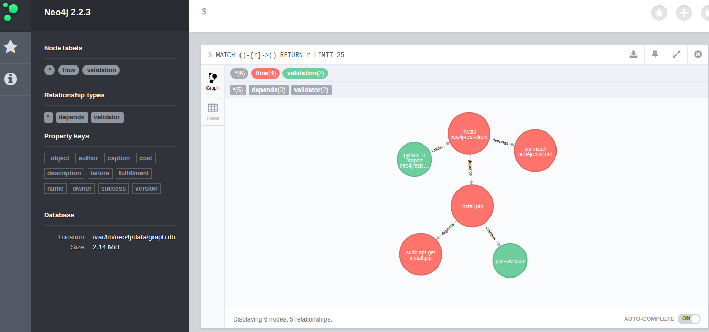

In-progress experiment implementing flows as a graph database.

The results of `demo.py` should look something like:

Assign some login parameters, these are local to your neo4j server.

    neo4j_login = {
        "username" : "neo4j",
        "password" : "tulsa",
        "url" : "http://localhost:7474"
    }

Create a new graph connection

    gdb = enhanced_GraphDatabase(**neo4j_login)

**WARNING**: this is a hard reset and will wipe any existing neo4j database. It's useful here for testing purposes only.

    gdb.hard_reset()

Define some flows:

    f1 = gdb.new_flow(description = "Install neo4j-rest-client")
    f2 = gdb.new_flow(description = "Install pip")
    f3 = gdb.new_flow(description = "sudo apt-get install pip")
    f4 = gdb.new_flow(description = "pip install neo4jrestclient")

Assign the dependencies.

    f1.relationships.create("depends", f2)
    f2.relationships.create("depends", f3)
    f1.relationships.create("depends", f4)

Add some validation steps:

    v = gdb.new_validation(
        command="pip --version",
        success="pip 7.0.3 ...",
        failure="command not found",
        )

    f2.relationships.create("validator", v)

    v = gdb.new_validation(
        command='python -c "import neo4jrestclient"',
        success="",
        failure="ImportError: No module named neo4jrestclient",
        )

    v.relationships.create("validator", f1)

### To dos:

+ Export flow, validation to json
+ Unit tests

+ Write logging.info hooks for each action
