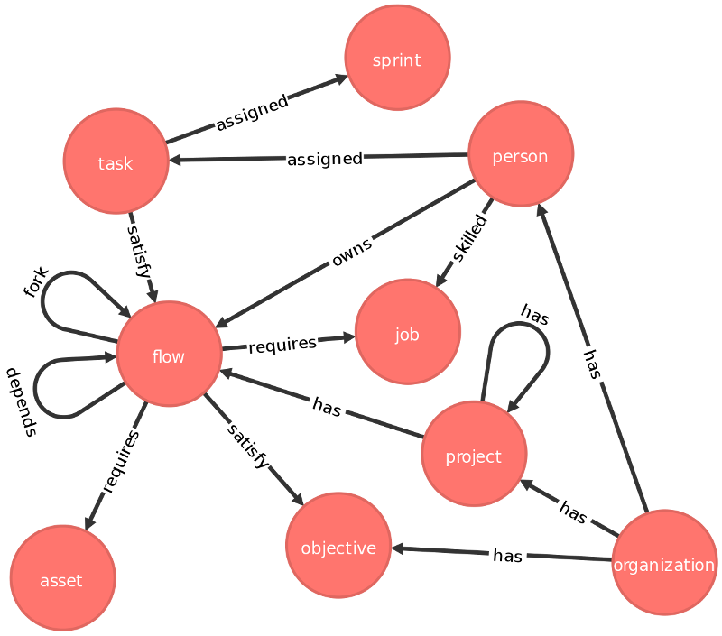
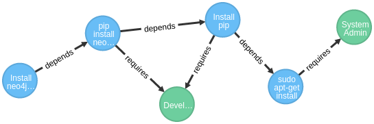

Implementing buildbot and it's flows as a graph database.

### Graph Schema

The graph schema can be auto-generated by `buildbot_flows/utils.py`

### Demo

The results of `demo.py` should look something like:

Assign some login parameters, these are local to your neo4j server.

    neo4j_login = {
        "username" : "neo4j",
        "password" : "tulsa",
        "url" : "http://localhost:7474"
    }

Create a new graph connection

    gdb = enhanced_GraphDatabase(**neo4j_login)

**WARNING**: this is a hard reset and will wipe any existing neo4j database. It's useful here for testing purposes only.

    hard_reset(gdb)

Define some flows and some relationships:

    flow = defined_nodes["flow"]
    job  = defined_nodes["job"]

    f1 = gdb.add_node(flow(description = "Install neo4j-rest-client"))
    f2 = gdb.add_node(flow(description = "pip install neo4jrestclient"))
    f3 = gdb.add_node(flow(description = "Install pip"))
    f4 = gdb.add_node(flow(description = "sudo apt-get install pip"))

    depends = defined_relationships[("flow","depends","flow")]
    gdb.add_relationship(depends(f1,f2))
    gdb.add_relationship(depends(f2,f3))
    gdb.add_relationship(depends(f3,f4))

    job_required = defined_relationships[("flow","requires","job")]
    developer = gdb.add_node(job(description = "Developer"))
    system_admin = gdb.add_node(job(description = "System Admin"))
    
    gdb.add_relationship(job_required(f3,developer,time=0.5))
    gdb.add_relationship(job_required(f2,developer,time=0.1))
    gdb.add_relationship(job_required(f4,system_admin,time=0.25))